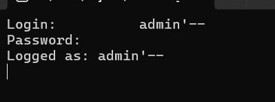
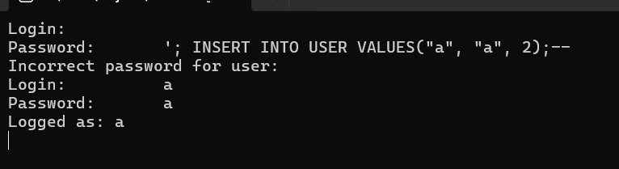
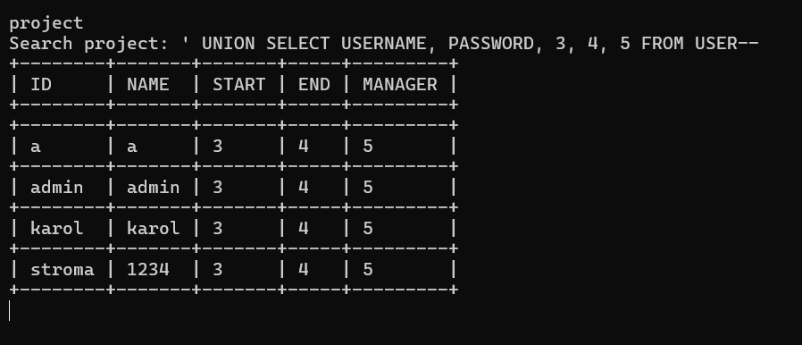

# About

This repository contains server and client projects for a database server.
It's purpose is to perform a penetration tests and incrementaly add layers of security.

Communication between clients and server is handled by the custom library ([ServerInfrastructure](https://github.com/tuStroma/ServerInfrastructure)) built on top of the Boost.Asio library. Database used in this project is SQLite 3 database engine.

### Functionalities

Server hosts a database, which can be accessed by the client application. To access the database users have to be logged in, after successfully logging in user can access the database in a way, that his privilidges lets him to do so.

### Attacks

1. SQL injection

Exploiting the volnurability, that the server doesn't parse the user input, attacker can bybass the logging phase by removing the password check in the SQL query, or even inserting new user with maximum privilidges.

When logged in the attacker can exploit the same volnurability to dump any table from database.

### Comming next

1. Man In The Middle WiFi attack using ARP poisoning to sniff and alter network traffic
